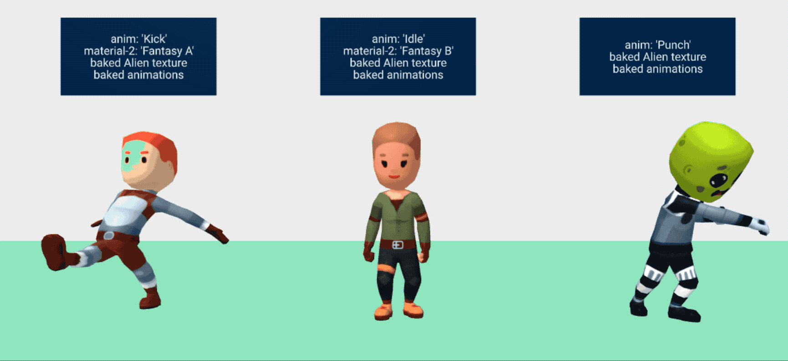

# Goal

The goal is to load [Kenney's Characters](https://kenney.itch.io/kenney-character-assets) into A-FRAME with working materials and animations.




## Creating the Asset
* Blender: adding an Image texture as the color map.
* Blender: adding FBX animations to the export.

## Runtime
* A-Frame: adding/overriding the color map with an image texture.
* A-Frame: playing animations.


## Geometry
The models from Kenney are in [FBX Format](https://en.wikipedia.org/wiki/FBX). This is very common format, unfortunately not one that works well with A-Frame. We need a the model in [GLTF Format](https://en.wikipedia.org/wiki/GlTF).

Before we can load models into A-Frame, we should have a base understanding of how to load 3D models with Three.JS. [Recommended Intro](https://threejs.org/docs/index.html#manual/en/introduction/Loading-3D-models)

**So how do we convert the file to our desired format?**

I started to make an [fbx-model component](./fbx-model-component.md), but gave up after the first error. It was not a problem I want to spend time on since Blender works so well.

Instead, I just imported the FBX model into [Blender](https://www.blender.org/) and then export it as a [GLTF](https://en.wikipedia.org/wiki/GlTF).

The sizing is not correct, and I have no idea why the large model is black, but the other two are white, but everything loads. Scaling is not a hard problem, so for now, I'm going to move on.


## Material

In order to make a [Mesh](https://threejs.org/docs/index.html#api/en/objects/Mesh), we need Geometry and a material. Problem one solved the Geometry problem, but no the material problem.

It is of course possible to export the model with the material in blender. But we want to dynamically change the material, so baking it into the model seems like the wrong approach.

In A-Frame, to add a material, use the material component.

```
<a-entity
  gltf-model-2="#modelLargeFemale"
  material="src: #skinCasualFemaleB"
  position="0 0 -5"
  ></a-entity>
```


Careful readers will notice I used [gltf-model-2](../src/gltf-model-2.js) instead of the standard `gltf-model` component.

This is because the standard gltf-model component sets the Mesh to the model root object. Kenney's models do not have the mesh on the root object, but nested inside. My fork looks for a child with the type `SkinnedMesh` and sets that as the Mesh.


## Animations

We have models and they have textures! So the last thing we need is animations. With the power of these three things combined, we will have a full working skin-able models! That is really a base need in any video game. Once this works, we will be able to use these working Kenney models in competition and game dev challenges.


