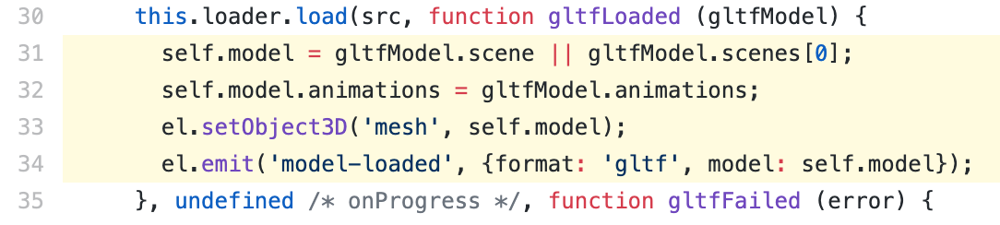
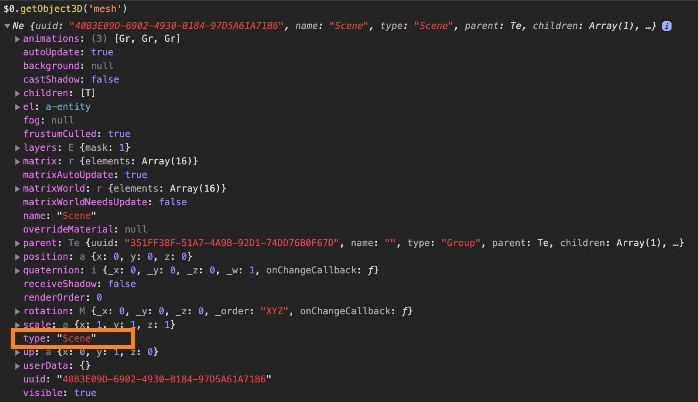
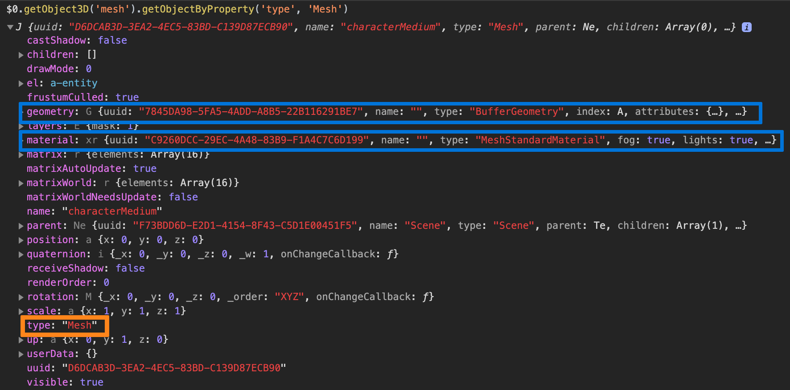
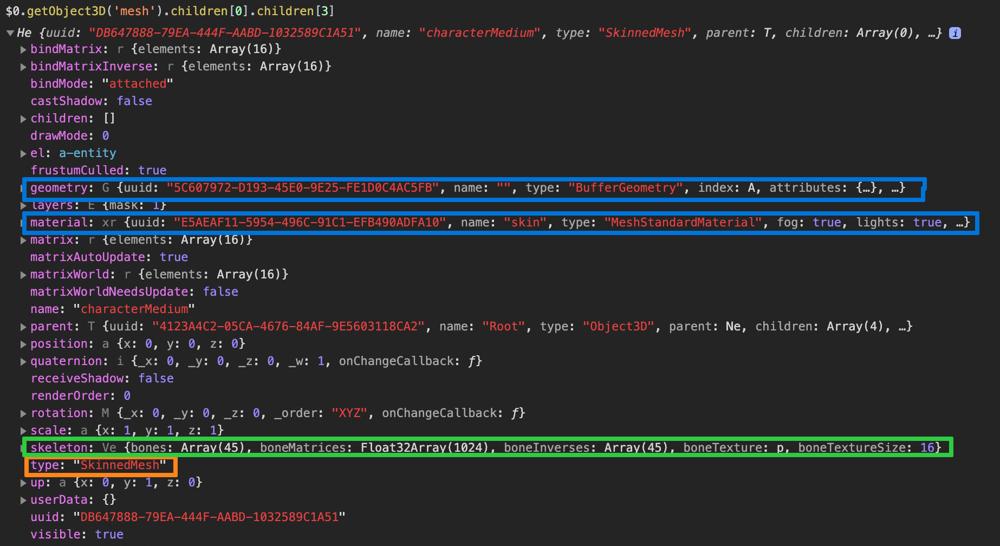
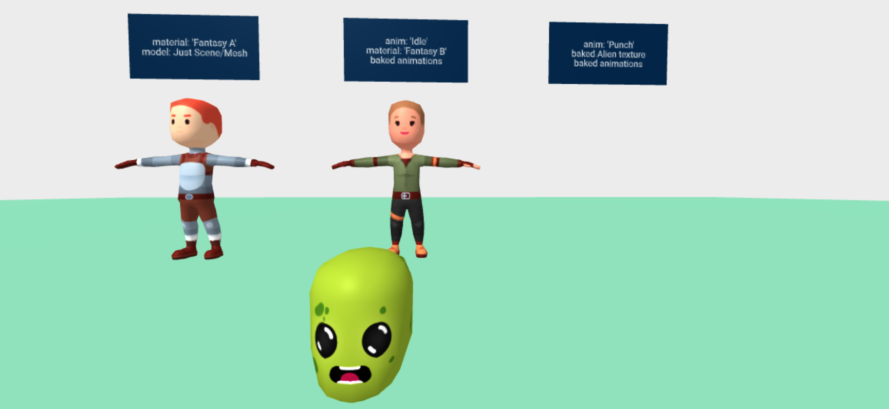

# The Issue

Applying material on a `gltf-model` does not change the model material. The image below shows models with a `material` component and the issue.


Example Markup:

```
<a-entity
  gltf-model="#model"
  material="src: #skin"
  >
</a-entity>

```


---
## Cause

The `material` component, along with other components, make use of `.getObject3D('mesh')` to get the [Mesh](https://threejs.org/docs/index.html#api/en/objects/Mesh) object.

> The [Mesh](https://threejs.org/docs/index.html#api/en/objects/Mesh) is an object with the `.geometry` and `.material` properties.

If we look at the [gltf-model source](https://github.com/aframevr/aframe/blob/master/src/components/gltf-model.js#L31-L34), we can see that `mesh` is set to the root scene object.



If we look at that object, we find a Scene, not an Mesh.



The Mesh is several nested layers deep into the Scene object. Thankfully we can use the `getObjectByProperty` to help find the Mesh, regardless of depth.



The Models rigged for bone animation have a [SkinnedMesh](https://threejs.org/docs/index.html#api/en/objects/SkinnedMesh) and a `skeleton` along with the standard Mesh properties.



---
## Fix

So the fix seems obvious. Make `.getObject3D('mesh')` return a [Mesh](https://threejs.org/docs/index.html#api/en/objects/Mesh) or [SkinnedMesh](https://threejs.org/docs/index.html#api/en/objects/SkinnedMesh) object instead of the scene.

Doing that, yields unexpected results. All the animations have broken and the one without a custom `material` component is displaying incorrectly.


