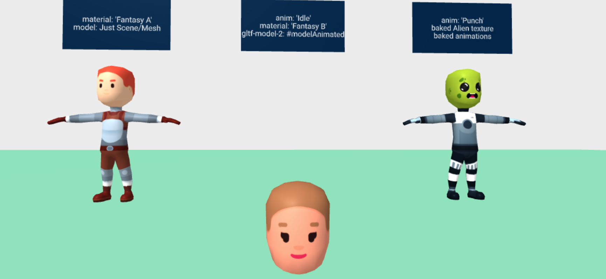
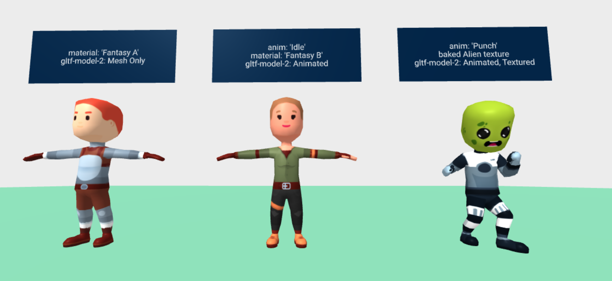
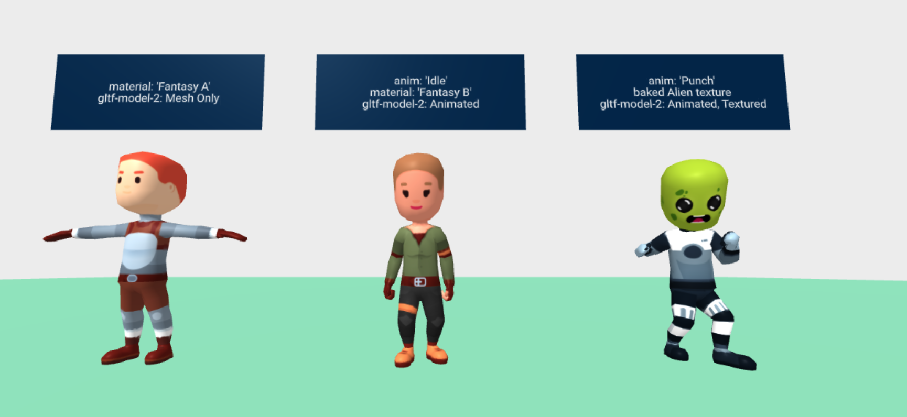

# The Issue

Applying material on a `gltf-model` does not change the model material. The image below shows models with a `material` component and the issue.


Example Markup:

```
<a-entity
  gltf-model="#model"
  material="src: #skin"
  >
</a-entity>

```


---
## Cause

The `material` component, along with other components, make use of `.getObject3D('mesh')` to get the [Mesh](https://threejs.org/docs/index.html#api/en/objects/Mesh) object.

> The [Mesh](https://threejs.org/docs/index.html#api/en/objects/Mesh) is an object with the `.geometry` and `.material` properties.

If we look at the [gltf-model source](https://github.com/aframevr/aframe/blob/master/src/components/gltf-model.js#L31-L34), we can see that `mesh` is set to the root scene object.


If we look at that object, we find a Scene, not a Mesh.


The Mesh is several nested layers deep into the Scene object. Thankfully we can use the `getObjectByProperty` to help find the Mesh, regardless of depth.


The Models rigged for bone animation have a [SkinnedMesh](https://threejs.org/docs/index.html#api/en/objects/SkinnedMesh) and a `skeleton` along with the standard Mesh properties.


---
## Fix Attempt - Patch gltf-model

So the fix seems obvious. Update/patch `gltf-model` component to set `mesh` value to the [Mesh](https://threejs.org/docs/index.html#api/en/objects/Mesh) or [SkinnedMesh](https://threejs.org/docs/index.html#api/en/objects/SkinnedMesh) object instead of the scene.

I forked gltf-model into [gltf-model-2](../src/gltf-model-2.js) and added the patch.

This allows the `material` component to update the texture but breaks animation and more.

Doing that yields unexpected results. All the animations have broken and the one without a custom `material` component is displaying incorrectly.


This is because [SkinnedMesh](https://threejs.org/docs/index.html#api/en/objects/SkinnedMesh) updates the model geometry based on bone positions.

By toggling on and off the SkinnedMesh, we can toggle the display issue.

```
// T-Pose
el.getObject3D('mesh').material.skinning = false;
el.getObject3D('mesh').material.needsUpdate = true;
// Broken
el.getObject3D('mesh').material.skinning = true;
el.getObject3D('mesh').material.needsUpdate = true;
```




## Fix Attempt - Patch gltf-model again




The Mesh and the root of the object used in animation are not always the same thing. I was using the Mesh as the root object for the animation, which is why when we turned on animation via skinning, the models moved to position `[0, 0, 0]`.

So A second patch is needed to save the animation root, along with the list of loaded animations.

This fixes the messed up alien head, but the model with the custom `material` is still stuck in the T-Pose. This is because the `material` component lost our `skinning = true` value when it replaced the existing material with its own.

If I turn on skinning in the console, I can see everything working as expected.



Unfortunately, this is not a problem I can fix in the `gltf-model-2` component. The `material` component replaces the loaded `material` after `gltf-model-2` has finished. But there is a place that runs when the animation does, and it could set the material. I can update [animation-control.js](../src/animation-control.js) to turn on material skinning.


## Conclusion

Everything works and I not only do I have a deeper understanding of this system. I also know how I can improve and isolate everything needed into a single component. That will be my next update, and final update before going into VR with these characters.
