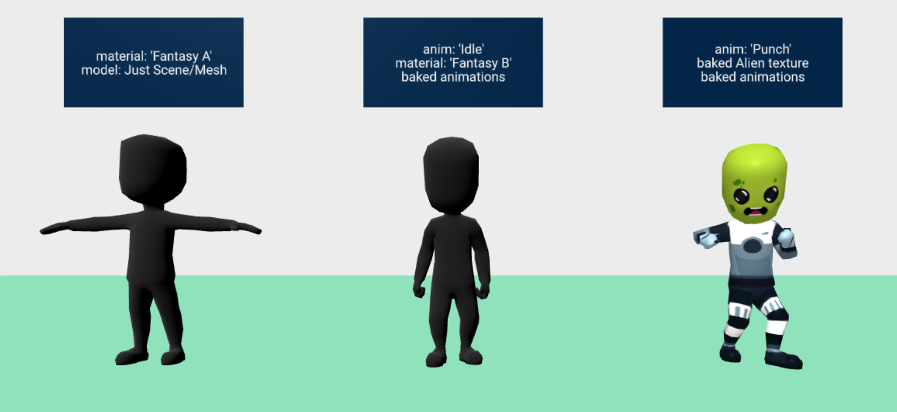
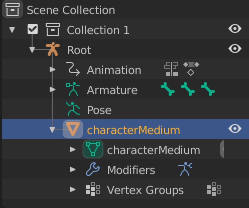

# The Issue

Applying material on a `gltf-model` does not change the model material. The image below shows models with a `material` component and the issue.



Example Markup:

```
<a-entity
  gltf-model="#model"
  material="src: #skin"
  >
</a-entity>

```


---
## Cause

The `material` component, along with other components, make use of `.getObject3D('mesh')` to get the [Mesh](https://threejs.org/docs/index.html#api/en/objects/Mesh) object.

> The [Mesh](https://threejs.org/docs/index.html#api/en/objects/Mesh) is an object with the `.geometry` and `.material` properties.

If we look at the [gltf-model source](https://github.com/aframevr/aframe/blob/master/src/components/gltf-model.js#L31-L34), we can see that `mesh` is set to the root scene object.


If we look at that object, we find a Scene, not a Mesh.


The Mesh is several nested layers deep into the Scene object. Thankfully we can use the `getObjectByProperty` to help find the Mesh, regardless of depth.


The Models rigged for bone animation have a [SkinnedMesh](https://threejs.org/docs/index.html#api/en/objects/SkinnedMesh) and a `skeleton` along with the standard Mesh properties.


---
## Fix  material component not applying to model

So the fix seems obvious. Update/patch `gltf-model` component to set `mesh` value to the [Mesh](https://threejs.org/docs/index.html#api/en/objects/Mesh) or [SkinnedMesh](https://threejs.org/docs/index.html#api/en/objects/SkinnedMesh) object instead of the scene.

I forked gltf-model into [gltf-model-2](../src/components/gltf-model-2.js) and added the patch.

This allows the `material` component to update the texture. 🎉

This exposed an issue with my `anim-mixer`. When it turned on material skinning the model collapsed to the world origin point `[0, 0, 0]`. This is because [SkinnedMesh](https://threejs.org/docs/index.html#api/en/objects/SkinnedMesh) updates the model geometry based on bone positions.

By toggling on and off the SkinnedMesh's `skinning` property, we can toggle the display issue.

```
// T-Pose
el.getObject3D('mesh').material.skinning = false;
el.getObject3D('mesh').material.needsUpdate = true;
// Broken
el.getObject3D('mesh').material.skinning = true;
el.getObject3D('mesh').material.needsUpdate = true;
```


---

## Fix animation root issue


The problem is caused by the wrong [Armature](https://docs.blender.org/manual/en/latest/animation/armatures/index.html) being passed as the root object to [AnimationMixer](https://threejs.org/docs/index.html#api/en/animation/AnimationMixer)


Looking at the file, we can see the Armature is the root object in the scene, and the Mesh (named `characterMedium`) is a child object.



This is fixed by exporting the armature object along with the mesh object in [gltf-model-2](../src/components/gltf-model-2.js).

```
// Set the object references
el.setObject3D('mesh', mesh);
el.setObject3D('armature', this.model);
```


With that change, [anim-mixer](../src/components/anim-mixer.js) can get the correct `armature`.

```
const armature = this.el.getObject3D('armature');
const mesh = this.el.getObject3D('mesh');

// Create the mixer to use the new armature.
this.mixer = new THREE.AnimationMixer(armature);

// Tell the mesh to allow animations.
mesh.material.skinning = true;
mesh.material.needsUpdate = true;

```


And now everything works! 🎉


