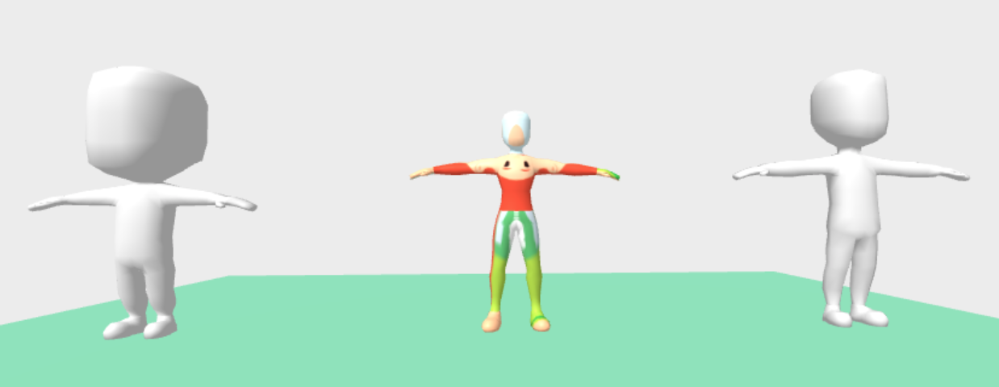
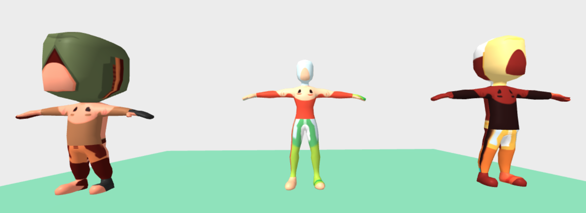

# Adding Materials

We have only one set Geometry, but materials for more than 20 Characters.

I am gong to start by adding a [material component](https://aframe.io/docs/0.9.0/components/material.html) with one of the image skins and seeing if everything magically works. Which of course, it does not.

```
<a-assets>
  <a-asset-item id="modelLargeFemale" src="./assets/largeFemale.gltf"></a-asset-item>
  <a-asset-item id="skinCasualFemaleB" src="./assets/casualFemaleB.png"></a-asset-item>
</a-assets>

<a-entity
  gltf-model="#modelLargeFemale"
  material="src: #skinCasualFemaleB"
  position="0 0 -5"
  >
</a-entity>

```

## Problem 1 - Texture does not show

I do not see any change in the appearance of the models. But if I inspect them, I see that the material is using the correct image.

So how do we debug this? How do we figure out why we are not seeing the texture, or any texture on the model?


First step, see if our material component is working. We should be able to set a solid color and see it if it works.

```
<a-entity id="elLarge"
  gltf-model="#modelLargeFemale"
  material="color: #FF851B"
  position="0 0 -5"
  >
</a-entity>
```

And it does not work. So from that, we know the component is having no effect. In order to debug this, we will have to dive into the THREE.js that powers A-Frame.

We can access the Object3D from `window.elLarge.object3D` and read the [API](https://threejs.org/docs/index.html#api/en/core/Object3D).

Looking though the children, I found that it is using a [SkinnedMesh](https://threejs.org/docs/index.html#api/en/objects/SkinnedMesh), `window.elLarge.object3D.getObjectByProperty('type', 'SkinnedMesh')`.

I can get some change, but not what I was expecting if I manually change the color in the console. If I try it on one of the white models, the color changes as expected. So this tells me I have some sort of lighting problem with the larger model. When I try the large male model, I get the white model like the others. So this debugging as told me that my large female model as an issue. After re-exporting the model, I got the white blank texture as expected.


```
var material = window.elLarge.object3D.getObjectByProperty('type', 'SkinnedMesh').material;
material.color = new THREE.Color('#85144b');
```

So this code works and the model changes color. So then why does the material component not work?

I took a look at the [source code](https://github.com/aframevr/aframe/blob/v0.9.0/src/components/material.js#L182) for material to see how it was finding the Mesh object.

```
// Set on mesh. If mesh does not exist, wait for it.
mesh = el.getObject3D('mesh');
```

It uses the [getObject3D](https://aframe.io/docs/0.9.0/core/entity.html#getobject3d-type) utility function to find the mesh. That function returns the root Scene object that was loaded from the GLTF model, not the SkinnedMesh that we want to update. Looking at the [source of getObject3D](https://github.com/aframevr/aframe/blob/v0.9.0/src/core/a-entity.js#L117), it looks like it is just a helper function to get the value from `this.object3DMap`. Following the trail, I found the cause in the [source for gltf-model](https://github.com/aframevr/aframe/blob/master/src/components/gltf-model.js#L33).

At this point I have a few options.

* Fork [gltf-model](https://github.com/aframevr/aframe/blob/master/src/components/gltf-model.js)
  * Best option, can create a PR to update the original.
* Create a component that calls [setObject3D](https://aframe.io/docs/0.9.0/core/entity.html#setobject3d-type-obj) to update the reference before setting the material source.
  * Method I would use in a hackathon or other competition. Easy to implement, but only patches the problem, does not solve it.
* Clean up the model so the existing gltf-model component works as expected.
  * A tool to clean up the cruft from format switching would be helpful for many projects.
* Use blender to change the model into the format expected by gltf-model component.
  * Worst option, very manual


The easiest to try is using blender to remove the extra wrappers. It causes the lighting on the model to appear strange. Because of this I am going to avoid options that modify the model files. I do not understand them well enough at this point, and I have other options.


I can verify the problem is the material being set on the wrong object by running this in the console:

```
window.elLarge.object3D.children[0].children[2].children[3].material = window.elLarge.object3DMap.mesh.material
```




I ended up doing option one, and forking the existing `gltf-model` as the imaginatively named `gltf-model-2`.



I added a utility method to get the Mesh from the model.

```
const mesh = this.getMesh(this.model);
el.setObject3D('mesh', mesh);
```

An a very basic to get the SkinnedMesh if it exists.
```
getMesh(model) {
  const mesh = model.getObjectByProperty('type', 'SkinnedMesh');
  if (mesh ) { return mesh; }
  // default to the root
  return model;
}
```

## Problem 2 - Texture position

It is great that we see the texture now, but it clearly is not positioned correctly.

I can get the texture from the map property on the material.
```
var mesh = elLarge.object3D.getObjectByProperty('type', 'SkinnedMesh');
var texture = mesh.material.map;
```


So after two days of struggling, the creator of Three.JS quickly pointed out my issue. The texture was flipped. Flipping the image file fixed the problem.


I had attempted to flip the texture on the console with.

```
texture.flipY = true;
```

If you try that, it will not work, you need mark the texture as needing an update. So you need to do

```
texture.flipY = true;
texture.needsUpdate = true;
```

for the change to apply. Or you can just flip the images, which is the solution I opted for.
