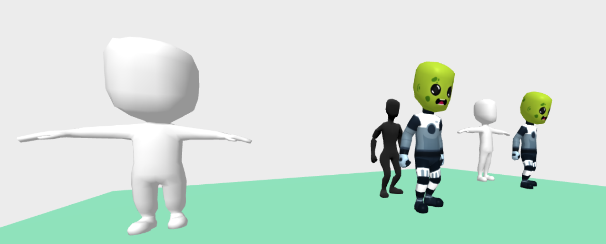
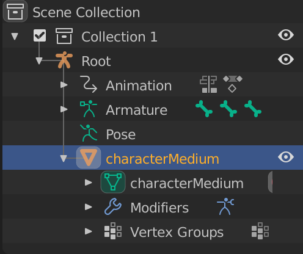
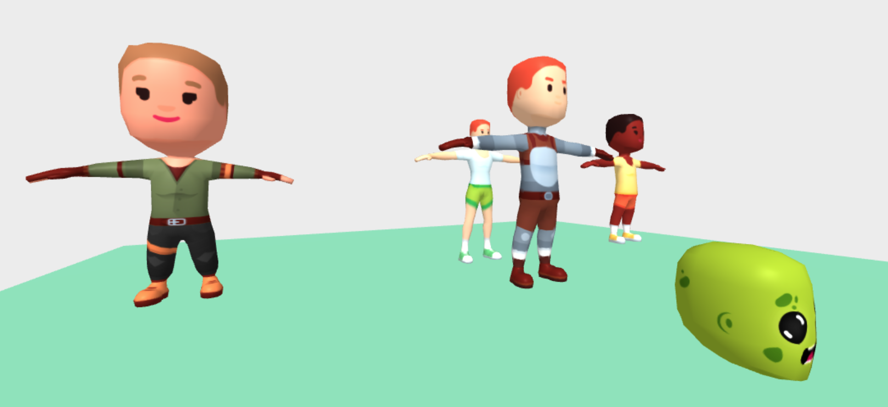
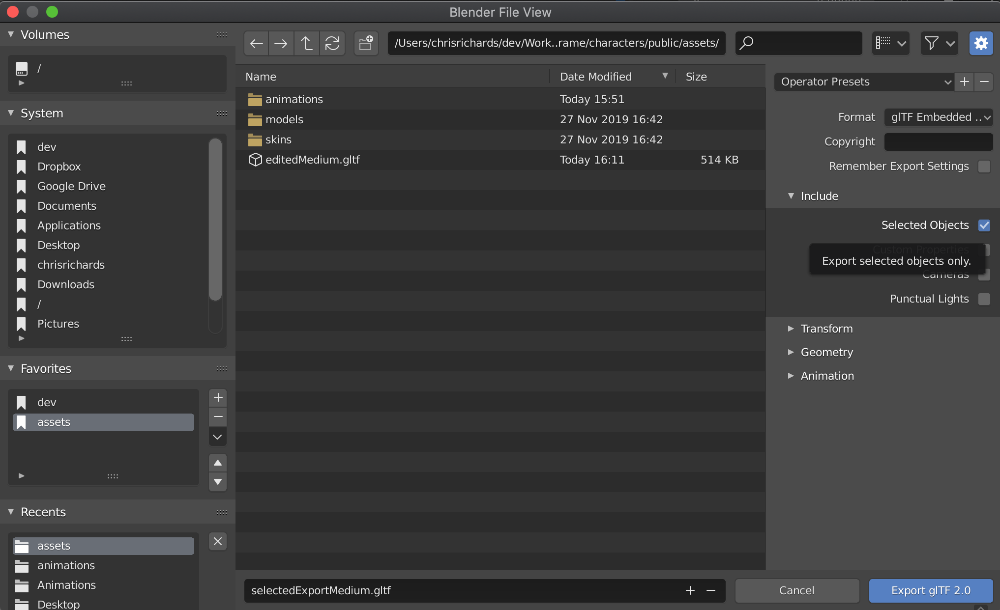

# Export Issues

;

```
<a-entity id="elMedium"
  gltf-model="#editedMedium"
  material="src: #skinFantasyFemaleA"
  position="0 0 -3"
  ></a-entity>

```

There is a lot of bugs in this one screen shot. All of the models should have texture images, but only the two that show them, are the ones with the texture built into the model. The center alien, has the wrong texture, the default skin should be over ridden.

* Models Appear Black/White even with `material` component
* Models showing a built in texture instead of the `material` texture.


# Why `material` is being ignored.

The problem is that the model has a root above the Mesh.

;

The object named "characterMedium" has the orange triangle on it. This is blender's way of telling is it's a Mesh object.

We can find it in A-FRAME or THREE.js by searching for the SkinnedMesh type.

```
const mesh = elMedium.object3D.getObjectByProperty('type', 'SkinnedMesh');
mesh.name // === 'characterMedium'
```

The reason this causes our problem, is because A-FRAME's `material` component looks for a Mesh with `elMedium.getObject3D('mesh')`. This mesh value is set by `gltf-model` to the root of the exported model.


We might consider fixing this by updating the mesh reference to the the SkinnedMesh from the model.

```
const mesh = elMedium.object3D.getObjectByProperty('type', 'SkinnedMesh');
elMedium.setObject3D('mesh', mesh);

```



This *almost* works. We can see all the white/black models are now loading their textures from the `material` component. But there are two issues, we lost the animations. We can see the middle models are not the idle pose, but instead are in their T pose. And the one model without a `material` component, the alien should be using the default texture. Instead the positions and scaling of the mesh is wrong. This is because it is missing the transforms provided by the root.

You might think, like I did, that you can just export the mesh to fix it. Blender has an export selected option, so it seems like that would work.



But doing that exports without geometry! Either I am doing something very wrong, or the selected export does not work.

For the life of me, I can not figure out a way to get a model that works with the default `gltf-model` component and allows changing the material with the `material` component.


## Attempting a fix

I have a few avenues of attack. I could try to fix the model, so it works with the default components. I could patch the components to work with a larger variety of models.

Of the two, I like the idea of working with more model formats. The model works in other programs. So the problem is not the model, but the way AFRAME's components expect the model to be structured.

Now that I decided I want to fix this on the A-FRAME side and not the model side. Where in A-FRAME do I want to patch? Do I update [material.js](https://github.com/aframevr/aframe/blob/v0.9.0/src/components/material.js#L184) to search though the children to find a `material` instead of adding on to the root of the `mesh` object. Or do I update [gltf-model](https://github.com/aframevr/aframe/blob/master/src/components/gltf-model.js#L33) to put the material on the root of `mesh`, even if the model had it nested deeper.

Of those two, I like the second option better. If I can fix it on `gltf-model`, then all the components that make assumptions like the `material` component will work. If I fix it on the `material` component, then it is possible other components will make the same assumption.

So I will start by trying to fix this on the `gltf-model` component with with my fork [gltf-model-2](../src/gltf-model-2.js)
