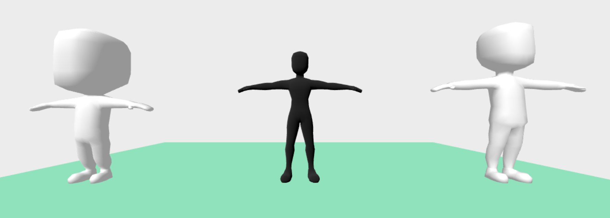
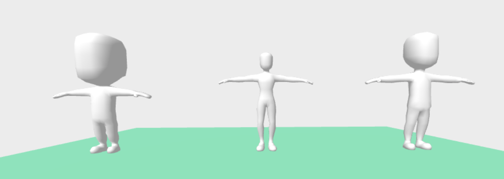

# Goal

Load the models from [Kenney's Character Assets](https://kenney.itch.io/kenney-character-assets) with animations into A-Frame and useable in in WebVR.

## Problem 1 - Format and Geometry
The models from Kenney are in [FBX Format](https://en.wikipedia.org/wiki/FBX). This is very common format, unfortunately not one that works well with A-Frame. We need a the model in [GLTF Format](https://en.wikipedia.org/wiki/GlTF).

Before we can load models into A-Frame, we should have a base understanding of how to load 3D models with Three.JS. [Recommended Intro](https://threejs.org/docs/index.html#manual/en/introduction/Loading-3D-models)

**So how do we convert the file to our desired format?**

I started to make an [fbx-model component](./fbx-model-component.md), but gave up after the first error. It was not a problem I want to spend time on since Blender works so well.

Instead, I just imported the FBX model into [Blender](https://www.blender.org/) and then export it as a [GLTF](https://en.wikipedia.org/wiki/GlTF).

The sizing is not correct, and I have no idea why the large model is black, but the other two are white, but everything loads. Scaling is not a hard problem, so for now, I'm going to move on.

After re-exporting the one black model.

;

## Problem 2 - Material

In order to make a [Mesh](https://threejs.org/docs/index.html#api/en/objects/Mesh), we need Geometry and a material. Problem one solved the Geometry problem, but no the material problem.

It is of course possible to export the model with the material in blender. But we want to dynamically change the material, so baking it into the model seems like the wrong approach.
